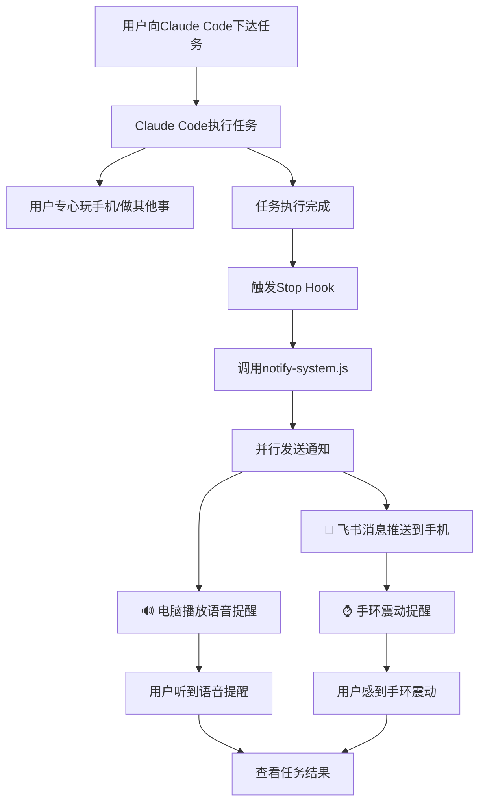

# Claude Code 任务完成提醒系统 (支持手环震动)

这是一个智能提醒系统，用于在Claude Code完成任务时通过多种方式提醒你，支持手机通知和手环震动，让你可以专心玩手机而不用频繁检查任务状态。

## 🎯 两大核心功能

| 功能 | 说明 | 数据流向 |
|------|------|----------|
| **任务完成通知** | Claude Code 完成任务时推送通知 | Claude Code → 飞书/Telegram |
| **远程控制** | 用手机向 Claude Code 发送指令 | 手机 ↔ Claude Code |

```
┌─────────────────────────────────────────────────────────┐
│                    功能一：任务完成通知                    │
│                                                         │
│   Claude Code ──完成任务──> 飞书Webhook ──> 手机通知      │
│                                            ↓            │
│                                         手环震动         │
└─────────────────────────────────────────────────────────┘

┌─────────────────────────────────────────────────────────┐
│                    功能二：远程控制                       │
│                                                         │
│   手机 ──发送消息──> Telegram/飞书Bot                    │
│                           ↓                             │
│                      Claude Code CLI                    │
│                           ↓                             │
│   手机 <──返回结果── Telegram/飞书Bot                    │
└─────────────────────────────────────────────────────────┘
```

---

## ⚡ 快速开始

### 只用功能一（任务完成通知）

1. **创建飞书 Webhook**
   - 飞书群 → 设置 → 群机器人 → 添加机器人 → 自定义机器人
   - 复制 Webhook 地址

2. **配置 `.env`**
   ```bash
   FEISHU_WEBHOOK_URL=你的Webhook地址
   ```

3. **配置 Claude Code Hook**

   在 `~/.claude/settings.json` 添加：
   ```json
   {
     "hooks": {
       "Stop": [{
         "hooks": [{
           "type": "command",
           "command": "node /path/to/ccdd/notify-system.js --message '任务完成'"
         }]
       }]
     }
   }
   ```

4. **测试**
   ```bash
   node notify-system.js --task "测试通知"
   ```

---

### 要用功能二（远程控制）

#### 方式 A：Telegram Bot（推荐，更简单）

1. **创建 Bot**
   - 打开 https://t.me/BotFather
   - 发送 `/newbot`，按提示创建
   - 复制 Token

2. **配置 `.env`**
   ```bash
   TELEGRAM_BOT_TOKEN=你的Token
   TELEGRAM_ALLOWED_CHAT_IDS=    # 先留空
   ```

3. **启动并获取 Chat ID**
   ```bash
   node bot-server.js
   ```
   然后在 Telegram 中给你的 Bot 发送 `/start`，Bot 会告诉你的 Chat ID

4. **配置白名单**
   ```bash
   TELEGRAM_ALLOWED_CHAT_IDS=你的ChatID
   ```

5. **重启 Bot**
   ```bash
   node bot-server.js
   ```

#### 方式 B：飞书应用机器人

1. **创建应用**
   - 打开 https://open.feishu.cn/app
   - 创建应用，启用"机器人"能力
   - 添加事件：`im.message.receive_v1`
   - 订阅方式选择"长连接"

2. **配置 `.env`**
   ```bash
   FEISHU_APP_ID=你的AppID
   FEISHU_APP_SECRET=你的AppSecret
   FEISHU_ALLOWED_OPEN_IDS=    # 先留空
   ```

3. **启动并获取 Open ID**
   ```bash
   node bot-server.js
   ```
   然后在飞书中给机器人发消息，Bot 会告诉你的 Open ID

4. **配置白名单并重启**

---

## 📱 远程控制命令

| 命令 | 说明 |
|------|------|
| `/start` | 显示 Bot 信息和你的 ID |
| `/new` | 清除会话，开始新对话 |
| `/status` | 显示当前项目和会话状态 |
| `/project <路径>` | 设置项目目录 |
| `/project` | 查看当前项目目录 |
| `/sessions` | 列出最近的 Claude Code 会话 |
| `/resume <id>` | 恢复指定会话 |
| `/help` | 显示帮助 |

**使用示例：**
```
你：/project C:/Users/PC/code/my-project
Bot：Project directory set to: C:/Users/PC/code/my-project

你：帮我看看这个项目的结构
Bot：🤔 Processing...
Bot：[Claude Code 的回复]
```

---

## 🔒 安全说明

远程控制功能需要配置白名单才能使用：

- **Telegram**: `TELEGRAM_ALLOWED_CHAT_IDS`
- **飞书**: `FEISHU_ALLOWED_OPEN_IDS`

**如果不配置白名单，Bot 会拒绝所有请求**（安全默认）。

其他安全特性：
- 速率限制：每用户每分钟最多 10 次请求
- 路径验证：阻止访问系统目录
- 输入长度限制：最大 10000 字符
- 错误信息脱敏：不暴露系统细节

---

## 🧪 测试命令

```bash
# 测试任务完成通知
node notify-system.js --task "测试通知"

# 测试飞书 Webhook
node feishu-notify.js --message "测试消息"

# 启动远程控制 Bot
node bot-server.js

# 检查配置是否正确
node check-config.js
```

---

## 📁 项目结构

```
ccdd/
├── notify-system.js           # 主通知系统（集成所有功能）
├── notification-manager.js    # 通知管理器（统一接口管理）
├── env-config.js             # 环境变量配置管理（统一环境变量）
├── feishu-notify.js          # 飞书通知模块
├── telegram-notify.js        # Telegram通知模块（支持代理）
├── setup-wizard.js           # 一键配置向导
├── .env                     # 环境变量配置（包含敏感信息，已git忽略）
├── .env.example            # 环境变量模板文件
├── .gitignore              # Git忽略文件配置
├── config.json             # 传统配置文件（可选）
├── package.json            # NPM项目配置
├── test-project/           # 测试项目
│   └── package.json
├── README.md               # 项目说明文档
├── SETUP.md                # 详细配置指南
└── task-completion-log.jsonl # 任务日志
```

## 🛠 安装和配置

### ⚡ 快速开始（推荐方式）

#### 方法1：使用配置向导 🧙‍♂️（推荐）
```bash
node setup-wizard.js
```
向导会自动帮你配置所有设置，包括安全存储webhook地址。

#### 方法2：手动配置 📝
1. 复制 `.env.example` 为 `.env`
2. 在飞书中创建群组，添加自定义机器人，复制webhook地址
3. 编辑 `.env` 文件，替换 `FEISHU_WEBHOOK_URL` 为你的实际地址

详细步骤请查看 [SETUP.md](./SETUP.md)

#### 步骤2：验证配置 ✅
```bash
# 测试完整通知系统
node notify-system.js --task "测试手环震动提醒"
```

#### 步骤3：重启Claude Code 🔄
重启Claude Code使配置生效，然后正常使用即可！

### 📋 配置说明

#### 环境变量配置（推荐方式）
`.env` 文件支持以下配置：

```bash
# 飞书Webhook地址
FEISHU_WEBHOOK_URL=https://open.feishu.cn/open-apis/bot/v2/hook/你的地址

# Telegram Bot配置
TELEGRAM_BOT_TOKEN=your_bot_token_here
TELEGRAM_CHAT_ID=your_chat_id_here

# HTTP代理配置（可选，用于Telegram）
HTTP_PROXY=http://127.0.0.1:7890
HTTPS_PROXY=http://127.0.0.1:7890

# 通知开关
NOTIFICATION_ENABLED=true    # 是否启用飞书通知
SOUND_ENABLED=true          # 是否启用声音提醒
```

#### Telegram配置步骤
1. 与 [@BotFather](https://t.me/BotFather) 对话，发送 `/newbot` 创建机器人
2. 获取 Bot Token
3. 与你的机器人发送一条消息
4. 访问 `https://api.telegram.org/bot<TOKEN>/getUpdates` 获取 Chat ID
5. 在 `.env` 文件中配置 `TELEGRAM_BOT_TOKEN` 和 `TELEGRAM_CHAT_ID`
6. 在 `config.json` 中将 `notification.telegram.enabled` 设为 `true`

#### 配置文件方式（可选）
`config.json` 仍然支持传统配置方式，环境变量会覆盖配置文件设置。

```json
{
  "notification": {
    "feishu": {
      "enabled": false
    },
    "telegram": {
      "enabled": true
    },
    "sound": {
      "enabled": false
    }
  }
}
```

### 🔧 Claude Code Hook配置

在 `~/.claude/settings.json` 中配置hook，任务完成时自动发送通知：

**推荐配置（使用统一通知系统）**：
```json
{
  "hooks": {
    "Stop": [{
      "hooks": [{
        "type": "command",
        "command": "node /projects/ccdd/notify-system.js --message 'Claude Code任务已完成'"
      }]
    }]
  }
}
```

**高级配置（自定义消息）**：
```json
{
  "hooks": {
    "Stop": [{
      "hooks": [{
        "type": "command",
        "command": "node /projects/ccdd/notify-system.js --message '代码优化完成'"
      }]
    }]
  }
}
```

该配置会：
- ✅ 自动识别项目名称并显示在通知标题
- 📱 发送飞书通知（如果配置了）
- 📲 发送Telegram通知（如果配置了）
- 🔊 播放声音提醒
- ⌚ 触发手环震动

## 🎯 使用效果

配置完成后，当Claude Code完成任务时：

1. **📱 手机通知**：飞书APP会收到任务完成消息
2. **⌚ 手环震动**：小米手环等智能设备会震动提醒
3. **🔊 语音提醒**：电脑播放"任务完成，已发送手机通知"

这样你就可以专心玩手机，当任务完成时通过手环震动就能知道！

## 🧪 测试功能

### 测试完整通知系统
```bash
node notify-system.js --task "测试任务"
```

### 只测试飞书通知
```bash
node feishu-notify.js --webhook "你的webhook地址" --message "测试消息"
```

### 只测试Telegram通知
```bash
node telegram-notify.js --message "测试消息"
```

### 只测试声音提醒
```bash
node notify-sound.js
```

### 测试Claude Code集成
```bash
cd test-project
npm run test
```

## 🔧 技术实现

### 架构设计
- **分层架构**：env-config → notification-manager → notify-system
- **模块化设计**：分离各种通知方式，独立开发和测试
- **统一接口**：通过NotificationManager统一管理所有通知
- **异步处理**：并行发送多种通知，提高响应速度
- **容错机制**：单一通知失败不影响其他通知方式
- **环境变量优先**：支持.env安全配置，保护敏感信息

### 安全特性
- 🔒 **环境变量保护**：敏感信息存储在.env文件中，已加入.gitignore
- 🔐 **配置隔离**：敏感配置与代码分离，防止意外泄露
- 🛡️ **模板化配置**：提供.env.example模板，便于团队协作
- 🌐 **代理支持**：Telegram通知支持HTTP/HTTPS代理，适应网络环境

### 核心模块
- **notify-system.js**：主通知系统，协调所有提醒方式
- **notification-manager.js**：通知管理器，统一管理各种通知接口
- **env-config.js**：环境变量配置管理，统一处理环境变量加载
- **feishu-notify.js**：飞书API调用模块，支持富文本消息
- **telegram-notify.js**：Telegram Bot API调用模块，支持HTTP/HTTPS代理
- **config.json**：传统的配置文件管理（可选）

### 智能功能
- 🧠 **项目名称识别**：自动识别当前项目名称（package.json > git仓库名 > 目录名）
- 📱 **手环适配**：消息格式优化，项目名优先显示，适配小屏幕设备
- 🔄 **跨项目支持**：无论从哪个目录启动Claude都能正确识别项目

### Hook集成
- 使用Claude Code的Stop hook，在任务完成时自动触发
- 不影响正常的任务执行流程
- 支持命令行参数自定义任务信息

## 📈 产品路线图

### 近期计划 (v1.2)
- [ ] 支持更多通知平台（微信、钉钉、企业微信）
- [ ] 添加任务执行时间统计
- [ ] 支持自定义通知模板
- [ ] 开发可视化配置界面

### 中期计划 (v2.0)
- [ ] 开发Claude Code官方插件
- [ ] 支持跨平台（macOS、Linux）
- [ ] 添加任务进度实时推送
- [ ] 支持群组协作通知

### 长期愿景
- [ ] 智能任务调度和优先级管理
- [ ] 集成更多智能穿戴设备
- [ ] 开发移动端APP
- [ ] 支持多AI平台集成

## 🏆 参赛亮点

### 解决的实际问题
1. **专注度提升**：开发者可以专心做其他事情，不用频繁检查任务状态
2. **效率优化**：及时获知任务完成，提高工作流程效率
3. **体验改善**：通过手环震动等私密提醒，不打扰他人

### 技术创新点
1. **多通道通知**：声音 + 手机推送 + 手环震动的立体提醒体系
2. **智能集成**：与Claude Code深度集成，自动触发通知
3. **模块化架构**：高度可扩展，支持多种通知方式
4. **用户友好**：配置简单，一键启用

### 商业价值
- **B2C市场**：面向个人开发者的小工具产品
- **B2B市场**：面向开发团队的协作效率工具
- **生态价值**：丰富AI编程工具生态，提升用户体验

## 🎯 完整使用流程



现在你只需要配置好飞书webhook，就能享受这个强大的提醒系统了！详细配置请查看 [SETUP.md](./SETUP.md)。

---

**让AI编程更专注，让开发更高效！** 🚀